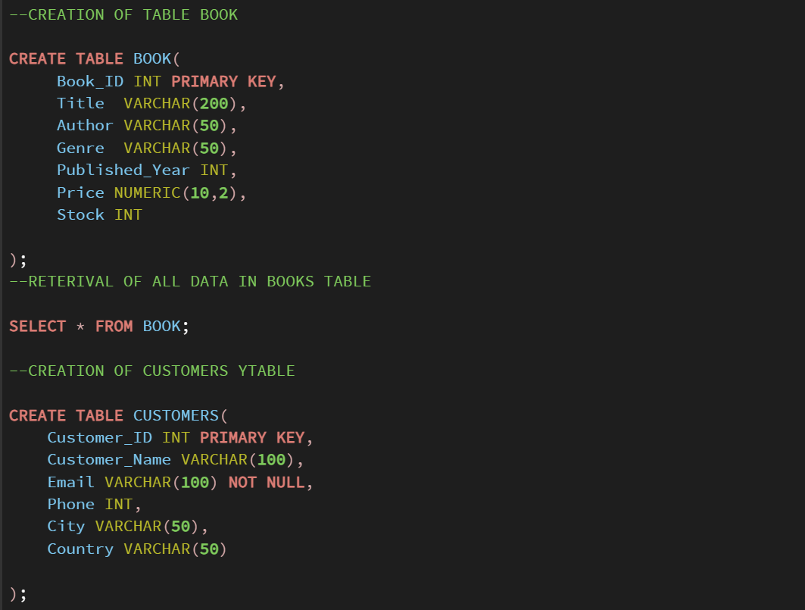
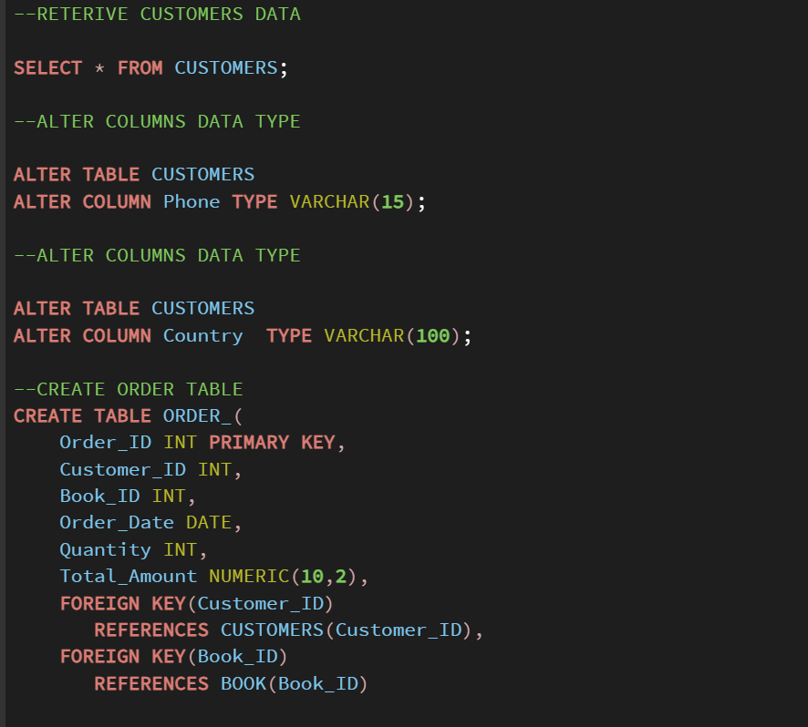
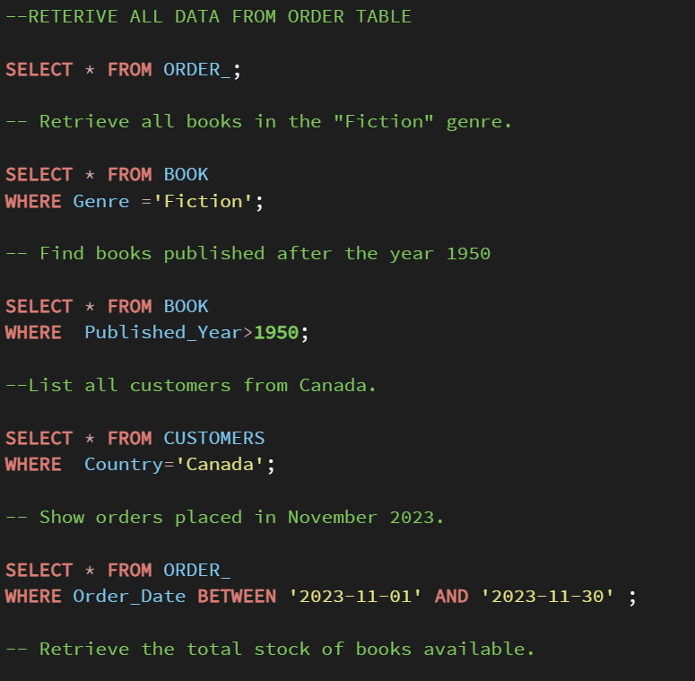
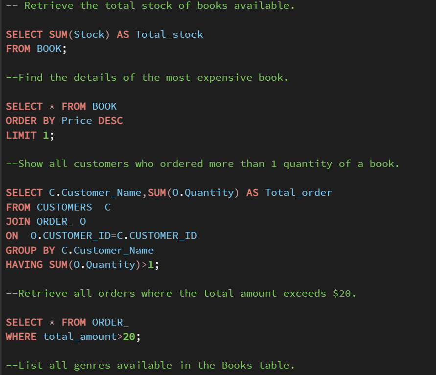
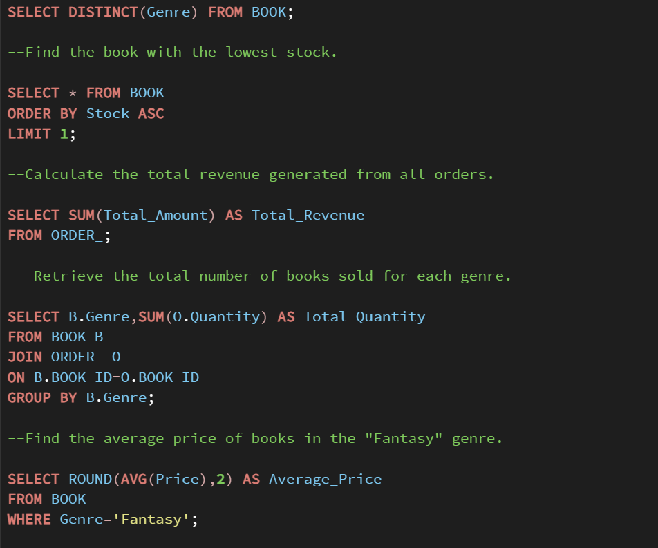
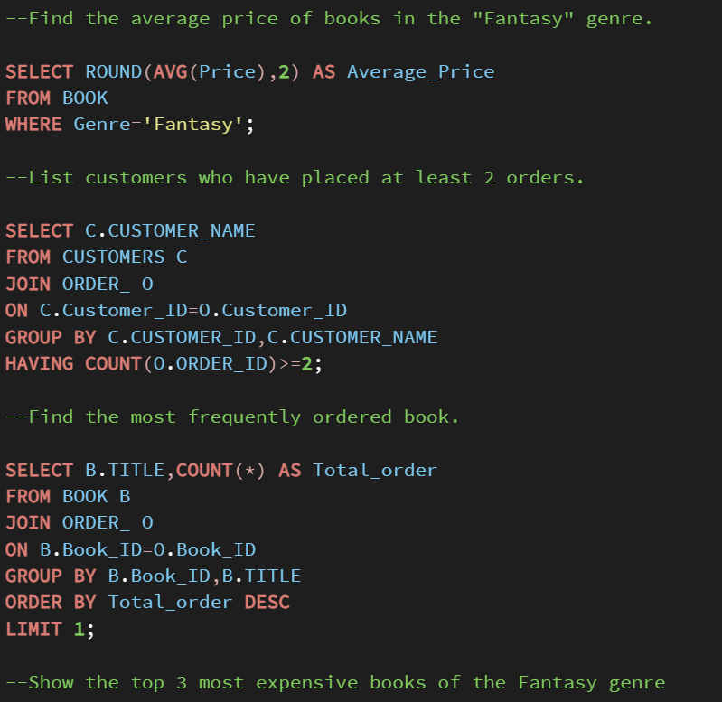
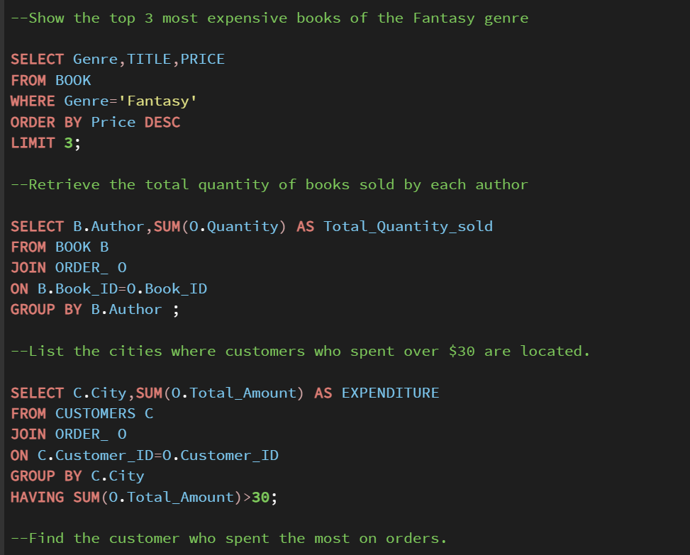
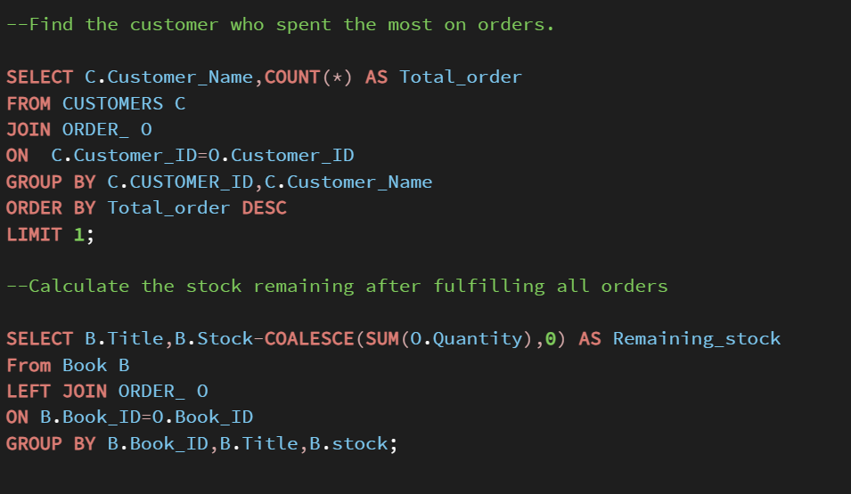

# SQL Book Store Analysis Project

## Project Overview

This project analyzes a Book Store database using SQL. The goal was to practice database design, table relationships, and data analysis by answering real-world business questions.

## Database Design

I created and worked with tables such as:

- Books
- Customers
- Orders

I established relationships between the tables using Primary Keys and Foreign Keys.

## Tasks Performed

### 1. Database Creation
- Created tables for Books, Customers, and Orders.
- Defined Primary Keys and Foreign Keys.
- Maintained data integrity between tables.

### 2. Data Analysis Using SQL
I wrote SQL queries to answer business questions such as:

- Find customers who placed at least 2 orders.
- Identify the most frequently ordered books.
- Calculate total sales by city.
- Find remaining stock after fulfilling orders.
- Analyze customer purchasing behavior.
- Generate sales and order summaries.

### 3. SQL Concepts Used
- SELECT statements
- WHERE clause
- ORDER BY
- GROUP BY
- HAVING
- Aggregate Functions (SUM, COUNT, AVG)
- INNER JOIN
- LEFT JOIN
- Subqueries
- Foreign Keys

## Key Insights

- Identified top-selling books.
- Determined repeat customers.
- Calculated city-wise sales performance.
- Tracked inventory after order fulfillment.

## Project Screenshots

### Database Tables

### Foreign Key Relationships

### Customer Analysis Query

### Book Order Analysis

### Sales Analysis

### Inventory Analysis

### Query Results

### Final Output

## Tools Used

- SQL
- VS Code
- PostgreSQL
- Git
- GitHub

## Author

Abhishek Chauhan
Email ID: a66054462@gmail.com